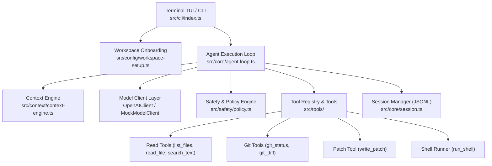

# RIG — Development Progress & Architecture Report

> **Project**: RIG (Terminal-Native AI Harness for Autonomous Agents)  
> **Repository**: `/Users/ayushnimbhare/Files/Projects/rig`  
> **Status**: Core runtime, interactive conversation UX, provider linking, session inspection/resume, code review and MCU scaffolding complete  
> **Last Updated**: September 13, 2026  

---

## 1. Project Overview

RIG is an engineering harness for autonomous AI agents that operate directly inside real codebases from the command line. Unlike standard web-chat wrappers, RIG provides a structured execution loop where the model inspects repositories, plans work, proposes structured patches, executes verification commands, and reports outcomes within strict safety boundaries.

---

## 2. Completed Architecture & Milestones



---

## 3. Detailed Component Breakdown

### A. Terminal User Interface (TUI) & Frontend
- **Design Aesthetic**: Pixel-perfect cyberpunk / neon purple interface inspired by OpenCode & Claude Code.
- **Top Bar**: macOS-style traffic light pills (`● ● ●`), active version (`rig v0.1.0`), dynamic shortened workspace path (`~/...`), and command shortcuts (`[ ⌘K to toggle ]`).
- **Ambient Scanlines & Glitch Pulse**: Seeded matrix-style scanlines on left/right margins. Glitch pulses flicker every 3.5–5s without moving the cursor or erasing background elements.
- **Interactive Boxed Input**: Rounded border container (`╭───╮`, `╰───╯`) with placeholder header, `›` input row with character cursor locking, navigation shortcuts (`↑↓ to navigate ↵ to send [→]`), and command footer.
- **Raw-Mode Keystroke Engine**: Full arrow key navigation (Left/Right), Backspace, Delete, Home (`Ctrl+A`), End (`Ctrl+E`), Enter, and instant `/clear`, `/help`, `/quit` commands.
- **Conversation View**: User and assistant turns remain in terminal scrollback; a single bottom-anchored boxed input stays available for the next prompt.
- **Thinking Indicator**: Themed animated spinner appears while the model and tools are working.
- **Provider Popup**: `/provider` opens a themed provider-selection popup with OpenAI, OpenRouter, Ollama, and custom endpoint options.

### B. Zero-Friction Workspace Onboarding
- **First-Run Detection**: When launched in any folder for the first time, detects if `.rig/` exists.
- **Interactive Setup Prompt**: Asks `✨ Initialize RIG for this workspace? [Y/n]`.
  - **On Yes / Enter**:
    - Creates `.rig/sessions/` and `.rig/cache/`.
    - Generates `.rig/config.json` with model preferences and approval settings.
    - Generates `.rig/instructions.md` template for custom project-level agent rules.
    - Appends `.rig/sessions/`, `.rig/cache/`, and `.rig/provider.json` to `.gitignore` to keep runtime data and credentials out of git.
  - **On No**: Runs in ephemeral mode without creating disk files.

### C. Core Agent Loop & Runtime
- **Multi-Step Execution**: Iterative loop (prompt → model → tool execution → observation → prompt update → final answer).
- **Safety Gating & Approvals**: Evaluates risk levels before executing tools; prompts user in terminal for permission on file writes and shell commands (bypassable with `--yes`).
- **Session Checkpointing**: Records append-only JSON Lines event logs (`events.jsonl`) and saves applied diffs as standalone `.patch` files in `.rig/sessions/<id>/patches/`.
- **Max Steps Safeguard**: Defaults to 30 steps with configurable CLI override (`--max-steps`).

### D. Model Client Layer
- **Universal Provider**: Supports standard OpenAI API (`OPENAI_API_KEY`), OpenRouter (`OPENROUTER_API_KEY`), or custom local OpenAI-compatible endpoints (`RIG_API_BASE_URL` / `OPENAI_BASE_URL`).
- **Dynamic Model Selection**: Configurable via `--model` flag or `RIG_MODEL` env var (default: `gpt-4o-mini`).
- **Mock Model Fallback**: Deterministic mock client for offline development and testing.
- **Provider Configuration**: Workspace-local provider settings are loaded automatically by the agent loop; credentials are written with user-only file permissions.

### E. Tool System
| Tool | Risk Level | Description |
|---|---|---|
| `list_files` | `read_only` | Directory listing with dotfile filtering. |
| `read_file` | `read_only` | UTF-8 text reader with line-range slicing and file size limits. |
| `search_text` | `read_only` | Ripgrep-powered text/regex search with case sensitivity options. |
| `git_status` | `read_only` | Branch and modified file tracking. |
| `git_diff` | `read_only` | Staged and unstaged git diff extraction. |
| `write_patch` | `workspace_write` | Unified diff patch applier with path traversal protection (`../`). |
| `run_shell` | `shell_write` | Timeout-managed command runner with output truncation. |

### F. Safety & Policy Engine
- **Risk Tiers**: `read_only`, `workspace_write`, `shell_verify`, `shell_write`, `dangerous`, `network`.
- **Command Risk Classifier**: Identifies and guards against high-risk commands (`rm -rf`, `git reset --hard`, `git clean -fd`, pipes to bash, etc.).

### G. npm Package & Global CLI Architecture
- **Global Link**: Installed globally on local machine via `npm link` so `rig` runs from any directory.
- **Dual Export**: Functions both as a global CLI binary (`dist/cli/index.js`) and an importable TypeScript SDK (`dist/index.js`).
- **Prepack Verification**: Automatically builds and runs all unit tests before any `npm publish` / packaging.

### H. Optional MCU Plugin
- **Profiles**: Arduino, ESP32 Arduino/PlatformIO, and ESP32 ESP-IDF.
- **Onboarding**: `setupMcuWorkspace` detects existing setup, writes `.rig/plugins/mcu.json`, and avoids overwriting files unless explicitly requested.
- **Generated Files**: Platform-specific starter sources, build configuration, and `README.mcu.md`.

---

## 4. File Structure

```text
rig/
├── .gitignore
├── LICENSE                          # MIT License
├── package.json                     # Dual CLI & SDK configuration
├── PROGRESS.md                      # This progress report
├── README.md                        # Package documentation & quickstart
├── rig-project-specification.md     # Full architectural specification
├── tsconfig.json                    # TypeScript compiler configuration
├── src/
│   ├── index.ts                     # Root SDK entrypoint
│   ├── version.ts                   # Version resolved from package.json
│   ├── cli/
│   │   ├── index.ts                 # CLI entrypoint & interactive REPL engine
│   │   ├── commands.ts              # rig config / log / resume / review commands
│   │   ├── fuzzy.ts                 # Fuzzy matching for pickers and slash commands
│   │   └── render.ts                # Cyberpunk TUI renderer & theme engine
│   ├── config/
│   │   ├── workspace-setup.ts       # First-run onboarding & workspace setup
│   │   ├── mcu-setup.ts             # Optional Arduino/ESP32 scaffolding
│   │   └── provider-setup.ts         # Provider persistence and loading
│   ├── context/
│   │   └── context-engine.ts        # Workspace context & system prompt builder
│   ├── core/
│   │   ├── agent-loop.ts            # Public agent loop entrypoint
│   │   ├── agent-loop-adapter.ts    # pi-style iterative execution loop
│   │   ├── agent-types.ts           # Core types, events, and results
│   │   ├── errors.ts                # Structured error classes
│   │   ├── events.ts                # Session event schemas
│   │   ├── model-factory.ts         # Single source of truth for model selection
│   │   └── session.ts               # SessionManager & JSONL logger
│   ├── model/
│   │   ├── message-types.ts         # Message schema types
│   │   ├── mock-model.ts            # Deterministic mock client
│   │   ├── pi-model-client.ts       # Offline fallback client (always self-labelled)
│   │   ├── model-client.ts          # Universal ModelClient interface
│   │   └── openai-client.ts         # OpenAI/OpenRouter client
│   ├── safety/
│   │   └── policy.ts                # Safety policy & command risk classifier
│   └── tools/
│       ├── default-registry.ts      # The canonical tool set (single definition)
│       ├── git.ts                   # git_status & git_diff tools
│       ├── read-only.ts             # list_files, read_file, search_text
│       ├── registry.ts              # ToolRegistry with Zod to JSON-schema conversion
│       ├── run-shell.ts             # run_shell runner with timeouts
│       ├── tool-types.ts            # Tool & ToolContext interfaces
│       └── write-patch.ts           # write_patch unified diff applier
├── tests/
│   ├── agent-loop.test.ts           # Multi-step loop, approval & fail-closed tests
│   ├── cli-exit-code.test.ts        # End-to-end exit-code contract (spawns the CLI)
│   ├── commands.test.ts             # config / log / resume / review & version tests
│   ├── model-source.test.ts         # provider / offline / mock classification tests
│   ├── pi-model-client.test.ts      # Offline fallback must never look like a real model
│   ├── policy.test.ts               # Safety risk classification tests
│   ├── render.test.ts               # Box geometry & cursor calculation tests
│   ├── run-shell.test.ts            # Shell runner execution & timeout tests
│   ├── session.test.ts              # Session persistence & JSONL tests
│   ├── setup.test.ts                # Workspace onboarding & gitignore tests
│   ├── mcu-setup.test.ts             # MCU scaffolding tests
│   ├── provider-setup.test.ts        # Provider persistence tests
│   ├── tools.test.ts                # Tool registry & JSON-schema contract tests
│   └── write-patch.test.ts          # Patch parsing & boundary security tests
└── dist/                            # Compiled production bundles & .d.ts types
```

---

## 5. Verification & Quality Metrics

| Check | Result | Details |
|---|---|---|
| **TypeScript Compilation** | ✅ **Clean (0 errors)** | `tsc --noEmit` |
| **Unit & Integration Tests** | ✅ **59 / 59 Passing** | `vitest run` (14 test suites) |
| **Production Build** | ✅ **Built successfully** | `tsup` ESM bundles + `.d.ts` types |
| **npm Package Dry Run** | ✅ **Whitelisted `dist`, `README`, `LICENSE`** | Version resolved from `package.json` at runtime |
| **Global CLI (`npm link`)** | ✅ **Verified** | Works globally across any local directory |

---

## 6. Recently Completed Work

1. **Zod 4 tool-schema generation** — `ToolRegistry.toJsonSchemas()` previously read
   `_def.typeName`, which Zod 4 removed, causing *every* tool parameter to be emitted as
   `required`. Schemas are now produced via Zod's native `toJSONSchema()` in `input` mode,
   with a Zod 3-aware hand-rolled fallback. Only genuinely mandatory parameters are
   required (`run_shell` → `command`, `write_patch` → `patch`, ...).
2. **Single-sourced version** — `src/version.ts` resolves the version from the nearest
   `package.json`, so `--version`, the top bar and both welcome screens can no longer drift
   from the published package.
3. **Non-TTY safety** — piping into `rig` or running it in CI now uses a plain
   line-oriented REPL instead of painting (and then discarding) the full-screen TUI.
4. **Fail-closed approvals** — when a tool requires approval, `autoApprove` is off and no
   `onApprovalRequest` handler was supplied, the action is refused and reported to the
   model rather than executed unattended.
5. **`rig config` / `rig log` / `rig resume` / `rig review`** — these were registered with
   no action handler and exited silently. All four are now implemented, with `--json`
   support where it makes sense. `resume` continues the original session via
   `AgentInput.resumeSessionId`.
6. **Offline fallback no longer impersonates a model** — `PiModelClient` previously replied
   with confident prose (*"Analysis complete for: … Model used: …"*) without contacting any
   provider, so a misconfigured setup looked like a working one. Every message it returns is
   now prefixed with `[offline fallback]`, states that no model was called, and names the
   model/thinking level it *would* have used. Guarded by `pi-model-client.test.ts`.
7. **Repo hygiene** — `.workbuddy-ai/` (local agent memory) added to `.gitignore` so it can
   never be published.
8. **Fail-closed exit codes** — `ask`, `run`, `review` and `resume` now exit `1` (with a
   stderr warning) when no real model produced the answer, so a shell script or CI job
   cannot mistake a scripted placeholder for a result. `AgentResult.modelSource` reports
   `provider` / `offline` / `mock`, and `isUnrealSource()` is exported for SDK callers. The
   warning goes to stderr so `--json` on stdout stays parseable. The interactive TUI is
   deliberately exempt — one offline turn should not end the session.
9. **De-duplicated the model and tool factories** — `createModelClient` and
   `createDefaultToolRegistry` existed twice: a public copy in `agent-loop.ts` and a private
   copy inside `agent-loop-adapter.ts`. Only the *private* copies actually ran, so fixing the
   public one changed nothing — the same trap as the original version drift. Both now live
   once, in `core/model-factory.ts` and `tools/default-registry.ts`, and the public entry
   points re-export them.

---

## 7. Next Steps / Remaining Roadmap

1. **Live Token Streaming**:
   - Real-time token streaming from providers during model generation.
2. **Session Replay in the TUI**:
   - Surface `rig log` output inside interactive mode instead of shelling out.
3. **Publish the current tree to npm**:
   - The published `0.1.1` predates the fixes above; bump and republish when ready.
